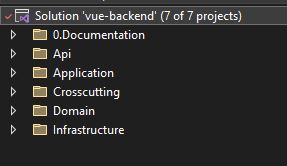
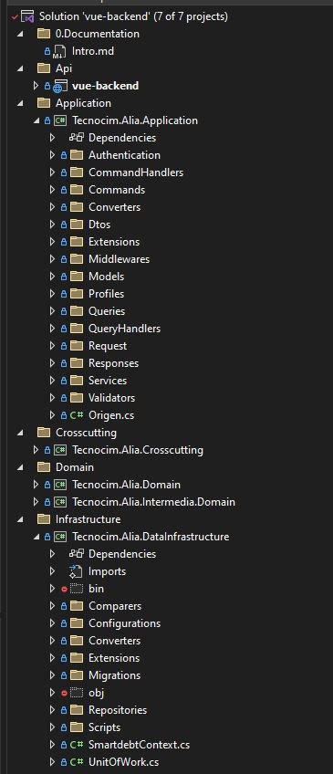
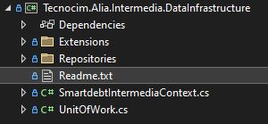

**Web API ALIA-TECNOCIM**

Marzo 2023, Joaquín Sosa<br/><br/>

# Índice

- [Índice](#índice)
- [Introducción](#introducción)
- [Ámbito](#ámbito)
- [Detalle Arquitectónico](#detalle-arquitectónico)
- [Autenticación](#autenticación)
- [Solución](#solución)
- [Proyectos](#proyectos)
  - [Domain](#domain)
  - [Infrastructure](#infrastructure)
  - [Application](#application)
  - [Web API](#web-api)
- [Referencias utilizadas](#referencias-utilizadas)

<br/>

# Introducción
 
En estás páginas se describe la solución adoptada para respaldar desde el lado de "backend" la aplicación ALIA-Tecnocim.
Se detalla el **diseño técnico** y la **estructura del código** de la solución.

<br/><br/>


# Ámbito

Esta documentación detalla los patrones arquitectónicos y de diseño empleados en el desarrollo de la Web Api.
Se muestran los diferentes proyectos de la solución así como su interrelación entre ellos.

<br/><br/>

# Detalle Arquitectónico

Esta Web Api se desarrolla siguiendo un enfoque **Domain Driven Design (DDD)** que tiene como parte principal modelar un **dominio** en base a las diferentes partes del negocio de la aplicación y cuya terminología es conocida por todos los participantes en el proceso (personal técnico y de negocio).
<br/><br/>
Se ha desarrollado una arquitectura en capas siguiendo un Modelo Vista Controlador (MVC), separando la solución en diferentes proyectos que nos permite un bajo acomplamiento y rehusabilidad del código.
<br/><br/>

# Autenticación
La autenticación usada está basada en JWT Bearer lo que implica la generación de un token que será enviado por el cliente (la aplicación SPA) en cada petición a la Web API.<br/>
Hay una política de refresco del token si este expira.
<br/>
La configuración se especifica en el fichero **Program.cs**:

```cs
builder.Services.AddAuthentication(x =>
{
    x.DefaultAuthenticateScheme = JwtBearerDefaults.AuthenticationScheme;
    x.DefaultChallengeScheme = JwtBearerDefaults.AuthenticationScheme;
    x.DefaultScheme = JwtBearerDefaults.AuthenticationScheme;
})
       .AddJwtBearer(x =>
       {
           x.RequireHttpsMetadata = false;
           x.SaveToken = true;
           x.TokenValidationParameters = new TokenValidationParameters
           {
               ValidateIssuerSigningKey = true,
               IssuerSigningKey = new SymmetricSecurityKey(key),
               ValidateIssuer = false,
               ValidateAudience = false
           };

       });
```
Mencionar que hay una autorización basada en roles para los endpoints.
<br/><br/>

# Solución

La solución de Visual Studio (2022) contiene una serie de carpetas de solución que nos permite agrupar capas y funcionalidades.
<br/><br/>

<br/><br/>
Podemos distinguir:

- **0.Documentación**: la carpeta que contiene esta documentación.
- **Api**: el proyecto de inicio que contiene los endpoints vía los controladores que son expuestos al exterior. Este proyecto contiene toda la configuración de la API así como el establecimiento de los "middleware" y características que va a tener. Este es el proyecto que se despliega.
-  **Application**: aquí encontramos los validadores de las peticiones así como los DTOs que van a ser enviados y recibidos por la API. Para desacoplar las capas hacemos uso del patrón **mediator** mediante el uso de la librería [Mediatr](https://github.com/jbogard/MediatR/wiki).
- **Crosscutting**: los proyectos ubicados en esta carpeta son transversales a toda la aplicación y pueden ser usados por cualquier capa.
- **Domain**: aquí tenemos la capa de dominio que contiene las entidades que forman los diferentes "bounded context" o contextos. Tendremos los agregados, entidades, enumerados así como los contratos o interfaces de los **repositorios** (patrón para aislar la aplicación de la capa de acceso a datos) y unidad de trabajo (unit of work o UoW).
- **Infrastructure**: nos encontramos en esta carpeta con la implementación de la capa de acceso a datos. En nuestro caso usamos [**Entity Framework Core 6**](https://learn.microsoft.com/es-es/aspnet/core/data/entity-framework-6?view=aspnetcore-6.0) como [ORM (Object Relational Mapping)](https://en.wikipedia.org/wiki/Object%E2%80%93relational_mapping) y tenemos toda su configuración asó como la implementación de los repositorios, los contextos a utilizar y la UoW.
  <br/><br/>
  
  
  <br/><br/>
  
  <br/><br/>


# Proyectos
Comenzamos por la capa de dominio.
## Domain

- **Tecnocim.Alia.Domain** y **Tecnocim.Alia.Intermedia.Domain**:
  <br/><br/>
  Contiene el dominio de la aplicación y tenemos los agregados y value objects (si es que los definimos), las entidades base y las diferentes entidades que podemos identificar en nuestro dominio de negocio. Ubicamos también los enumerados que vamos a usar y los contratos o interfaces de los repositorios.
  <br/><br/>
  Las entidades se tratan de [POCO](https://es.wikipedia.org/wiki/Plain_Old_CLR_Object) y es un dominio anémico (los modelos anémicos contienen clases que se utilizan para mantener el estado de la aplicación, normalmente son los modelos CRUD, o los llamados PO(J|C)O, Plain Old ( Java | CLR ) Object, o la letra que quieras según el lenguaje, definido por algunos como un antipatrón, ya que no mantienen el estado y no tienen comportamiento).
  <br/><br/>
  Tenemos una interfaz genérica **IRepository<TEntity>** que va a contener los métodos comunes de acceso a datos y que nos va a servir para sólo definir los métodos una única vez y por herencia lo extendemos al resto de entidades.
  <br/><br/>
  Se define también una interfaz **IUnitOfWork** que nos permite la implementación del patrón [Unit of Work](https://www.c-sharpcorner.com/UploadFile/b1df45/unit-of-work-in-repository-pattern/) "unidad de trabajo" (UoW) y trabajar con varias entidades del mismo contexto usando transacciones y realizar varias operaciones y sólo persistir los cambios en los datos (como una unidad) en el momento de guardar (SaveChanges).
<br/><br/>

## Infrastructure
- **Tecnocim.Alia.DataInfrastructure** y **Tecnocim.Alia.Intermedia.DataInfrastructure**
<br/><br/>
Estos proyectos contienen la **implementación de los repositorios** cuyo contrato están en los proyectos ".Domain", la **implementación de la Unit of Work** y en el caso en el que estamos, que usamos como **ORM Entity Framework Core 6**, el contexto **SmartdebtContext**.
<br/><br/>
Tenemos una carpeta script para incluir scripts SQL normalmente para hacer un "feed" de tablas sobre todo maestras o referenciales.
<br/><br/>
En nuestro caso seguimos una aproximación **"Code First"**, lo que quiere decir que definimos las clases del modelo que luego se transforman en las tablas, vistas, ... en la base de datos donde se vaya a persistir. Se hace uso de **"Migrations"** que nos permite ir modificando el modelo y realizar los cambios de forma incremental y bajo control.
<br/>
Para crear y ejecutar migraciones contra la base de datos existen dos comandos:<br/>
  - **Add-Migration** NombreMigración -Context SmartdebtContext (en el caso de que haya mas de un contexto en el mismo proyecto)<br/>
  - **update-database**  


  que pueden ser ejecutados en el Package Manager Console del Visual Studio.
  <br/>Para poder usar las Migrations hay que referenciar en este proyecto las diferentes librerías de Entity Framework: <br/>
    ```xml
   <PackageReference Include="Microsoft.EntityFrameworkCore" Version="6.0.8" />
    <PackageReference Include="Microsoft.EntityFrameworkCore.Relational" Version="6.0.8" />
    <PackageReference Include="Microsoft.EntityFrameworkCore.SqlServer" Version="6.0.8" />
    <PackageReference Include="Microsoft.EntityFrameworkCore.Tools" Version="6.0.8">
   ```

Por otra parte, **Existe un documento Readme.txt en el proyecto Tecnocim.Alia.Intermedia.DataInfrastructure** en el que se describe el rpoceso para seguir una aproximación **"Database First"**, que es el que se ha seguido en este (Intermedia) en concreto.
<br/><br/>
Existe una carpeta **Configurations** que contiene la definición para cada entidad de los tipos, restricciones de sus propiedades y las relaciones existentes con otras entidades.
<br/><br/>
Mencionar también una carpeta muy importante llamada **Extensions** que va a aparecer también en el proyectos de **Application** que entre métodos extensores y utilidades, tenemos el fichero **ServiceCollectionExtensions.cs** que contiene un método de extension del IServiceCollection que se define en el punto de inicio de la Web Api (Program.cs) y en el que se van a definir:<br/>

   - Definición y propiedades del contexto y de la base de datos a usar.
   - Registro en el contenedor de inyección de dependencias propio del framework .NET Core del Unit of Work y de los diferentes repositorios.
  
```cs
 services.AddDbContext<SmartdebtContext>(options =>
        {
            options.UseSqlServer(connectionString, sqlOptions => sqlOptions.EnableRetryOnFailure());
            options.EnableSensitiveDataLogging();
        }, ServiceLifetime.Transient);

        services.AddScoped<IUnitOfWork, UnitOfWork>();
        services.AddScoped<IEmpresaRepository, EmpresaRepository>();
        services.AddScoped<IUsuarioRepository, UsuarioRepository>();
        services.AddScoped<IRolRepository, RolRepository>();
        ...
```
  
 ## Application
  - **Tecnocim.Alia.Application**
  <br/>
  En este proyecto tenemos toda la lógica de la aplicación. Pasamos a describir cada carpeta y lo que encontramos en ellas.

    - **Authentication**: clases auxiliares para trabajar con los [JSON Web Tokens (JWT)](https://jwt.io/).
    - **Commands**: para conseguir bajo acomplamiento usamos el patrón **publish/subscribe** [(opcionalmente)](https://hoangnguyen.name/difference-between-observer-pubsub-and-mediator/) mediante la librería **Mediatr**.
 <br/>Usamos **Commands** para hacer referencia a una acción que va a cambiar el estado de nuestra aplicación (insert, update, delete) y **Queries** para la obtención de datos.
 
 En esta carpeta están todos los comandos que vamos a utilizar. Por ejemplo:
   ```cs
 public record struct CreateContratoCommand(CreateContratoRequest contrato) : IRequest<GenericResult<CreateContratoResponse>>;
   ```
  En el que tenemos un record struct con un parámetro que será el DTO enviado desde el cliente (aplicación web) y la respuesta en el caso que la tenga.<br/>
  **GenericResult** es una clase que hace de wrapper para todas las respuestas y en la que podemos setear el código de error y error en el caso de que exista, así como el resultado en la propiedad "Result" y si ha ido bien o mal la petición.<br/>
  
  -  **CommandHandlers**: aquí están todos los "receivers" de los comandos que se publiquen. Por ejemplo en el del CreateContratoCommand vemos que escucha a este comando y que genera una respuesta del tipo GenericResult<"CreateContratoResponse">:
  ```cs
  public class CreateContratoCommandHandler : IRequestHandler<CreateContratoCommand, GenericResult<CreateContratoResponse>>
    {
        private readonly IUnitOfWork _unitOfWork;
        private readonly IMapper _mapper;
        private readonly ILogger<CreateContratoCommandHandler> _logger;
        ...
```
- **Dtos**: clases de intercambio que pueden ser auxiliares o bien utilizadas en las requests y responses.

- **Extensions**: como se indico antes, aquí tenemos varias clases con métodos extensores de utilidad y además el **ApplicationExtensions.cs** en el que tenemos el registro en el contenedor de inyección de dependencias de los servicios, utilidades y perfiles de mapeo (Automapper).
  
- **Middlewares**: aquí incluimos los posibles middlewares que vayamos a utilizar en el pipelines de request de la api. En este caso sólo tenemos uno para el JWT, que nos va a asegurar que todas las llamadas que necesiten autorización, tengan este encabezado en las peticiones y además sea válido.
- **Models**: clases de uso común en esta capa como ApplicationException, Authentication, Fichero y constantes.
- **Profiles**: usamos **Automapper** para mapear objetos en otros de forma automática previa definición de ciertos perfiles para cada entidad que necesite ser transformada.
- **Queries**: clases que van a ser enviadas vía el mediator para la obtención de datos, como por ejemplo:

```cs
public class GetCirculantePorEntidadesByEmpresaIdQuery : IRequest<GenericResult<TotalEntidadesResponse>>
{
    public GetCirculantePorEntidadesByEmpresaIdQuery(int empresaId)
    {
        EmpresaId = empresaId;
    }

    public int EmpresaId { get; }
}
```
- **QueryHandlers**: los correspondientes receptores de la publicación de las queries.
  
```cs
public class GetEmpresaByIdQueryHandler : IRequestHandler<GetEmpresaByIdQuery, EmpresaDto>
{
    ...
  ```
- **Request** y **Responses**: igual que los Dtos pero particularizados para diferenciar las clases de las peticiones de las respuestas.
- **Services**: aquí tenemos servicios que pueden consumir apis de terceros o realizan alguna funcionalidad concreta. En este caso tenemos el del **Extractor** y uno de **Usuario** específico para la autenticación.
- **Validators**: se usa la librería [FluentValidation](https://docs.fluentvalidation.net/en/latest/) que permite realizar validaciones de forma sencilla. Por ejemplo para validar los "Dtos" recibidos en las peticiones (request). Establece un conjunto de reglas a cumplir.
<br/><br/>
<br/>
## Web API
- **vue-backend**
  <br/><br/>
  Este es el proyecto principal de la Web Api. Aqui se encuentran los diferentes endpoints (en varios controllers) que pueden ser consumidos por un cliente.
  <br/>A la hora de agrupar los controllers y los endpoints algunos controllers se han creado como clases parciales para no tener clases con demasiadas líneas y difíciles de mantener.
  <br/>Los controllers son muy simples, limitándose a realizar alguna validación de permisos de usuario con empresa y hacen uso del mediator para hacer un "Send" de la query o del command correpondiente. En función del resultado devuelven si ha ido bien o mal la operación.
  <br/><br/>
  Tenemos el fichero **appsettings.config** donde tenemos todas las variables de configuración de la aplicación: cadenas de conexión, valores para el cálculo del token, ...
  <br/><br/>
  La aplicación hace uso de la librería **NLog** para registrar en fichero diferentes trazas o errores y poder debugar y encontrar fácilmente cualquier "issue" que se pueda producir. La configuración reside en el fichero NLog.config.
  <br/><br/>
  Clase **Program.cs**: esta es el punto de inicio donde se configura y se inicia la web api. Nos encontramos configuraciones como:
<br/> 
  - Cargar la configuración del logger e indicar el uso de NLog.
  - Crear el builder (la web application)
  - Cargar la configuración general del fichero del appsettings.config.
  - Llamar a los métodos extensores definidos antes en cada proyecto dentro de la carpeta Extensions y que nos permite entre otras cosas realizar el registro en el contenedor de IoC.
  - Indicar que se usa AutoMapper y MediatR.
  - Permitir CORS.
  - Especificar opciones en los controlers para la serialización JSON.
  - Indicar el uso de FluentValidation.
  - Configurar la autenticación usando JWT Bearer.
  - Añadir los servicios de autorización.
  - Configuración de los endpoints de la API y de Swagger.
  - Opciones de desarrollo (Exception Page).
  - Indicar el uso de Swagger y SwaggerUI.
  - Indicar HttpsRedirection, uso de CORS y especificar el tipo.
  - Usar autenticación y autorización.
  - Indicar el uso del JWT Middleware.
  <br/>
  <br/>
# Referencias utilizadas

| Librería     | Versión       |
| ------------- |:-------------:|
| Microsoft.EntityFrameworkCore | 6.0.8       |
| BCrypt.Net-Next         | 4.0.3         |
| LinqKit.Microsoft.EntityFrameworkCore | 6.1.2 |
| Microsoft.EntityFrameworkCore.Relational | 6.0.8 |
| Microsoft.EntityFrameworkCore.SqlServer | 6.0.8 |
| Microsoft.EntityFrameworkCore.Tools | 6.0.8 |
| Microsoft.EntityFrameworkCore.Design | 6.0.8 |
| AutoMapper | 11.0.1 |
| FluentValidation.AspNetCore | 11.2.2 |
| MediatR | 10.0.1 |
| MediatR.Extensions.Microsoft.DependencyInjection | 10.0.1 |
| Microsoft.Extensions.DependencyInjection | 6.0.0 |
| Microsoft.Extensions.Http.Polly | 6.0.8 |
| Microsoft.AspNetCore.Http.Abstractions | 2.2.0|
| Microsoft.AspNetCore.Identity | 2.2.0 |
| Microsoft.AspNetCore.Authentication.JwtBearer | 6.0.8 |
| Microsoft.IdentityModel.Tokens | 6.23.0|
| Microsoft.IdentityModel.Tokens.Jwt | 6.22.1|
| System.Security.Claims | 4.3.0 |
| AutoMapper.Extensions.Microsoft.DependencyInjection |  11.0.0 |
| FluentValidation.AspNetCore | 11.2.2 |
| Microsoft.VisualStudio.SlowCheetah | 4.0.8 |
| NLog | 5.0.4 |
| NLog.Web.AspNetCore | 5.1.4 |
| Swashbuckle.AspNetCore | 6.4.0 |

 